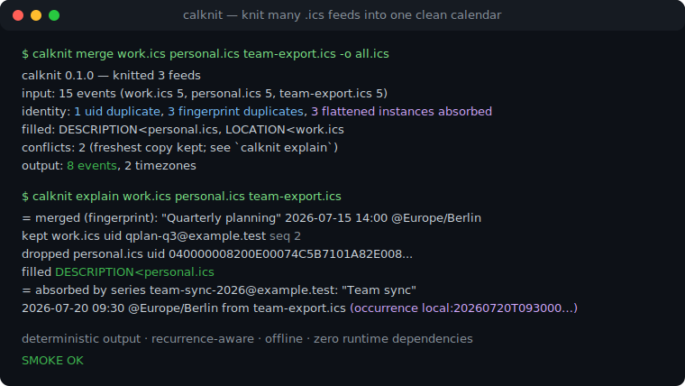
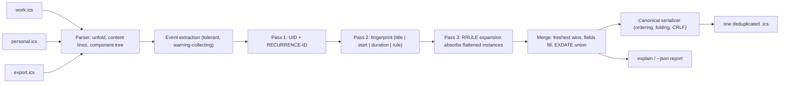

# calknit

[English](README.md) | [中文](README.zh.md) | [日本語](README.ja.md)

[](LICENSE)   [](CONTRIBUTING.md)

**calknit は複数の .ics フィードを重複排除済みの正規カレンダーファイル 1 つに統合します——フィード横断のイベント同一性マッチング、繰り返しルールを理解した重複排除、完全オフライン、ランタイム依存ゼロ。**



```bash
# not yet on npm — install from a checkout of this repository
npm install && npm run build && npm pack
npm install -g ./calknit-0.1.0.tgz
```

## なぜ calknit？

カレンダーの乱立はイベントを際限なく重複させます。プロバイダのフィード、メールクライアントの招待、アプリのエクスポートが同じ会議を抱えており——UID は 3 通り、タイムゾーン表記は 2 通り、タイトルには "Invitation:" プレフィックスまで付きます。.ics ファイルの連結（多くのマージスクリプトやホスト型マージサービスのやり方）は全コピーを残し、単一ファイルの lint ツールは 1 フィードは整えられてもフィード間はまったく見えません。calknit は証拠の強い順に 3 パスでフィード*間*の同一性を解決します。まず厳密な `UID`+`RECURRENCE-ID`、次に保守的なフィンガープリント（正規化タイトル + 同じ時計上の同じ開始時刻 + 厳密な所要時間。Windows→IANA の TZID 正規化により Outlook のコピーが Google の双子と一致）、最後に繰り返し吸収——本物の RRULE エンジンが生き残った各シリーズを展開し、フラット化エクスポータが発生ごとに吐き出す単発コピーを吸収します。最新のコピーが勝ち、敗者は欠けたフィールドを提供し、`EXDATE` は和集合になり、すべての判断は `calknit explain` で確認できます。出力は正規で決定的、diff 可能な 1 つの .ics です。

|  | calknit | MergeCal（ホスト型） | ics-merger（npm） | vdirsyncer |
|---|---|---|---|---|
| フィード横断の同一性マッチング（UID を超えて） | あり——タイトル+開始+所要時間のフィンガープリント | なし——連結のみ | なし——連結のみ | なし——同期であって統合ではない |
| 繰り返しルールを理解した重複排除（フラット化インスタンス） | あり、RRULE で計算 | なし | なし | なし |
| ローカルファイルをオフライン処理 | はい | いいえ（SaaS、フィードはサーバー側で取得） | はい | はい |
| 決定的で diff 可能な出力 | はい、バイト単位で安定 + 冪等 | 該当なし | いいえ | 該当なし |
| すべての統合判断を説明 | はい（`explain`、`--json`） | いいえ | いいえ | いいえ |
| ランタイム依存 | 0（Node.js のみ） | ホスト型サービス | npm パッケージ | Python + ライブラリ |

<sub>各機能の主張は各プロジェクトの公開ドキュメントに照らして確認、2026-07。</sub>

## 特徴

- **連結ではなくフィード横断の同一性**——異なる UID の同一イベントを保守的なフィンガープリントで発見：正規化タイトル、同じ時計上の同じ開始時刻、厳密な所要時間。3 つすべての一致が必須で、タイトルだけで統合することは決してありません。
- **繰り返しルールを理解した重複排除**——内蔵 RRULE エンジン（DAILY/WEEKLY/MONTHLY/YEARLY、BYDAY 序数、BYMONTHDAY、BYSETPOS、WKST、EXDATE/RDATE）が生き残ったシリーズを展開し、他ツールが永遠に重複させる発生ごとのフラット化コピーを吸収します。
- **タイムゾーン表記の揺れに強い**——`TZID=W. Europe Standard Time` と `TZID=Europe/Berlin` は Windows→IANA エイリアス表で同一のフィンガープリントに；グローバル一意 ID プレフィックスや引用符も正規化され、オフセット計算も tz データベースも不要です。
- **最新コピーが勝ち、情報は失われない**——優先順位は `SEQUENCE`、`LAST-MODIFIED`、`DTSTAMP`、フィードの指定順；敗者は欠けた `LOCATION`/`DESCRIPTION`/`URL`/... を提供し、`EXDATE` はコピー間で和集合になり、フィールドの不一致は衝突として報告されます（`--strict` で終了コード 1）。
- **決定的な正規出力**——固定プロパティ順、イベントのソート、75 オクテットで UTF-8 安全な折り返し、CRLF、参照される VTIMEZONE のみ保持：同じフィードからは同じバイト列が出て、統合済みファイルの再統合は何も変えません。
- **判断の過程を見せる**——`calknit explain` が保持/破棄/補完/吸収の各判断を出所つきで表示；`--json` は同じ内容を機械向け契約として提供します。
- **ランタイム依存ゼロ、完全オフライン**——必要なのは Node.js だけ；ツールはソケットを一切開かず、devDependency は `typescript` のみです。

## クイックスタート

インストール（上記）後、同梱の 3 つのサンプルフィードを編み合わせます：

```bash
calknit merge examples/feeds/work.ics examples/feeds/personal.ics examples/feeds/team-export.ics -o all.ics
```

出力（実際の実行記録——カレンダーは `all.ics` へ、レポートは stderr へ）：

```text
calknit 0.1.0 — knitted 3 feeds
  input:  15 events (work.ics 5, personal.ics 5, team-export.ics 5)
  identity: 1 uid duplicate, 3 fingerprint duplicates, 3 flattened instances absorbed
  filled: DESCRIPTION<personal.ics, LOCATION<work.ics
  conflicts: 2 (freshest copy kept; see `calknit explain`)
  output: 8 events, 2 timezones
```

統合の理由を問い合わせる（実際の実行からの抜粋）：

```text
= merged (fingerprint): "Quarterly planning" 2026-07-15 14:00 @Europe/Berlin
    kept    work.ics  uid qplan-q3@example.test seq 2
    dropped personal.ics  uid 040000008200E00074C5B7101A82E00800000000A1D52E@example.test
    filled  DESCRIPTION<personal.ics
    conflict SUMMARY: kept "Quarterly planning", dropped "Invitation: Quarterly planning" (personal.ics)

= absorbed by series team-sync-2026@example.test: "Team sync" 2026-07-20 09:30 @Europe/Berlin from team-export.ics (occurrence local:20260720T093000@europe/berlin)
```

カレンダーアプリに `all.ics` を購読させるか、cron で統合を回してください——出力はバイト単位で安定しているので、下流の同期は本当に変化があったときだけ動きます。

## コマンドと終了コード

| コマンド | 動作 | 終了コード |
|---|---|---|
| `calknit merge <feeds...>` | フィードを 1 つのカレンダーに編み合わせる（stdout または `-o FILE`） | 0 / 1（`--strict`）/ 2 |
| `calknit explain <feeds...>` | すべての同一性判断を表示；何も書き込まない | 0 / 1（`--strict`）/ 2 |
| `calknit inspect <feeds...>` | フィードごとの統計（イベント、シリーズ、タイムゾーン、期間） | 0 / 1（`--strict`）/ 2 |

終了コード 2 は用法・構文解析・IO エラーを対象とし、回復可能な問題（壊れた `DTSTART`、未知の RRULE パート）は失敗ではなく警告に格下げされます。

## オプション

| キー | 既定値 | 効果 |
|---|---|---|
| `--match <level>` | `full` | `uid` = RFC の同一性のみ；`fingerprint` = + タイトル/開始/所要時間；`full` = + 繰り返し吸収 |
| `--horizon <days>` | `1096` | 吸収時に各シリーズ開始からどこまで発生を展開するか |
| `-o, --output <file>` | stdout | 統合カレンダーの書き込み先 |
| `--calname <name>` | なし | 出力に `X-WR-CALNAME` を設定 |
| `--json` | オフ | 機械可読レポート（merge のレポートは stderr へ） |
| `--quiet` | オフ | merge：stderr レポートを抑制 |
| `--strict` | オフ | 入力警告またはフィールド衝突で終了コード 1 |

同一性ルールの完全版は [docs/matching.md](docs/matching.md)、出力の保証は [docs/canonical-format.md](docs/canonical-format.md) にあります。`SOURCE_DATE_EPOCH` は再現可能なパイプライン向けに合成 `DTSTAMP` を固定します。

## アーキテクチャ



## ロードマップ

- [x] 3 パス同一性エンジン（UID、フィンガープリント、繰り返し吸収）、BYDAY/BYMONTHDAY/BYSETPOS/WKST 対応の RRULE 展開、Windows→IANA TZID 正規化、フィールド補完 + EXDATE 和集合つきの最新優先マージ、正規で決定的な出力、`explain`/`inspect`/`--json`——89 テスト + `scripts/smoke.sh`（v0.1.0）
- [ ] キャンセルを理解した統合：`STATUS:CANCELLED` のコピーを生き残ったシリーズの `EXDATE` に変換
- [ ] `calknit watch`：入力ファイルが変わったら自動で再統合
- [ ] フィード別ルール：マッチング前の include/exclude フィルタとタイトル書き換え
- [ ] 手動確認用のニアミスレポート（同タイトルで開始時刻が N 分以内）をオプション提供

完全なリストは [open issues](https://github.com/JaydenCJ/calknit/issues) を参照してください。

## コントリビュート

コントリビュート歓迎です。`npm install && npm run build` でビルドし、`npm test`（89 テスト）と `bash scripts/smoke.sh`（`SMOKE OK` の表示が必須）を実行してください——このリポジトリは CI を持たず、上記の主張はすべてローカル実行で検証されています。[CONTRIBUTING.md](CONTRIBUTING.md) を参照し、[good first issue](https://github.com/JaydenCJ/calknit/issues?q=is%3Aissue+is%3Aopen+label%3A%22good+first+issue%22) を選ぶか、[discussion](https://github.com/JaydenCJ/calknit/discussions) を始めてください。

## ライセンス

[MIT](LICENSE)
