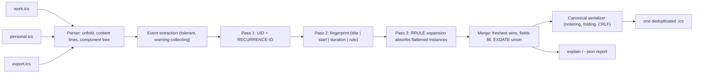

# calknit

[English](README.md) | [中文](README.zh.md) | [日本語](README.ja.md)

[](LICENSE)   [](CONTRIBUTING.md)

**calknit merges multiple .ics feeds into one deduplicated canonical calendar file — cross-feed event identity matching, recurrence-aware dedupe, fully offline, zero runtime dependencies.**


```bash
# not yet on npm — install from a checkout of this repository
npm install && npm run build && npm pack
npm install -g ./calknit-0.1.0.tgz
```

## Why calknit?

Calendar sprawl duplicates events endlessly: the provider feed, the mail-client invite and the app export all carry the same meeting — under three different UIDs, two timezone spellings and one "Invitation:" prefix. Concatenating .ics files (what most merge scripts and hosted mergers do) keeps every copy; single-file linters can tidy one feed but cannot see across feeds at all. calknit resolves identity *across* feeds in three evidence-ordered passes: exact `UID`+`RECURRENCE-ID`, then a conservative fingerprint (normalized title + same start on the same clock + exact duration, with Windows→IANA TZID normalization so an Outlook copy matches its Google twin), then recurrence absorption — a real RRULE engine expands each surviving series and swallows the standalone copies that flattened exporters emit for every occurrence. The freshest copy wins, losers donate missing fields, `EXDATE`s union, and every decision is reportable via `calknit explain`. The output is one canonical, deterministic, diffable .ics.

|  | calknit | MergeCal (hosted) | ics-merger (npm) | vdirsyncer |
|---|---|---|---|---|
| Cross-feed identity matching (beyond UID) | yes — title+start+duration fingerprint | no — concatenates | no — concatenates | no — sync, not merge |
| Recurrence-aware dedupe (flattened instances) | yes, RRULE-computed | no | no | no |
| Runs offline on local files | yes | no (SaaS, feeds fetched server-side) | yes | yes |
| Deterministic, diffable output | yes, byte-stable + idempotent | n/a | no | n/a |
| Explains every merge decision | yes (`explain`, `--json`) | no | no | no |
| Runtime dependencies | 0 (Node.js only) | hosted service | npm packages | Python + libraries |

<sub>Capability claims checked against each project's public documentation, 2026-07.</sub>

## Features

- **Cross-feed identity, not concatenation** — the same event under different UIDs is found by a conservative fingerprint: normalized title, identical start on the same clock, exact duration. All three must agree; calknit never merges on title alone.
- **Recurrence-aware dedupe** — a built-in RRULE engine (DAILY/WEEKLY/MONTHLY/YEARLY, BYDAY ordinals, BYMONTHDAY, BYSETPOS, WKST, EXDATE/RDATE) expands surviving series and absorbs the flattened per-occurrence copies other tools duplicate forever.
- **Timezone-spelling proof** — `TZID=W. Europe Standard Time` and `TZID=Europe/Berlin` fingerprint identically via a Windows→IANA alias table; globally-unique-ID prefixes and quoting are normalized away, with no offset math and no tz database.
- **Freshest copy wins, nothing is lost** — precedence by `SEQUENCE`, `LAST-MODIFIED`, `DTSTAMP`, then feed order; losers donate missing `LOCATION`/`DESCRIPTION`/`URL`/..., `EXDATE`s union across copies, and field disagreements are reported as conflicts (exit 1 under `--strict`).
- **Deterministic canonical output** — fixed property order, sorted events, 75-octet UTF-8-safe folding, CRLF, referenced-only VTIMEZONEs: same feeds in, same bytes out, and re-merging the merged file changes nothing.
- **Shows its work** — `calknit explain` prints every kept/dropped/filled/absorbed decision with provenance; `--json` gives the same as a machine contract.
- **Zero runtime dependencies, fully offline** — Node.js is the only requirement; the tool never opens a socket, and `typescript` is the sole devDependency.

## Quickstart

Install (see above), then knit the three bundled example feeds:

```bash
calknit merge examples/feeds/work.ics examples/feeds/personal.ics examples/feeds/team-export.ics -o all.ics
```

Output (real captured run — the calendar goes to `all.ics`, the report to stderr):

```text
calknit 0.1.0 — knitted 3 feeds
  input:  15 events (work.ics 5, personal.ics 5, team-export.ics 5)
  identity: 1 uid duplicate, 3 fingerprint duplicates, 3 flattened instances absorbed
  filled: DESCRIPTION<personal.ics, LOCATION<work.ics
  conflicts: 2 (freshest copy kept; see `calknit explain`)
  output: 8 events, 2 timezones
```

Ask why anything was merged (real captured excerpt):

```text
= merged (fingerprint): "Quarterly planning" 2026-07-15 14:00 @Europe/Berlin
    kept    work.ics  uid qplan-q3@example.test seq 2
    dropped personal.ics  uid 040000008200E00074C5B7101A82E00800000000A1D52E@example.test
    filled  DESCRIPTION<personal.ics
    conflict SUMMARY: kept "Quarterly planning", dropped "Invitation: Quarterly planning" (personal.ics)

= absorbed by series team-sync-2026@example.test: "Team sync" 2026-07-20 09:30 @Europe/Berlin from team-export.ics (occurrence local:20260720T093000@europe/berlin)
```

Point your calendar app at `all.ics`, or re-run the merge in cron — the output is byte-stable, so downstream syncs only fire when something really changed.

## Commands and exit codes

| Command | Does | Exit codes |
|---|---|---|
| `calknit merge <feeds...>` | knit feeds into one calendar (stdout or `-o FILE`) | 0 / 1 (`--strict`) / 2 |
| `calknit explain <feeds...>` | print every identity decision; writes nothing | 0 / 1 (`--strict`) / 2 |
| `calknit inspect <feeds...>` | per-feed statistics (events, series, timezones, range) | 0 / 1 (`--strict`) / 2 |

Exit 2 covers usage, parse and IO errors; recoverable oddities (a bad `DTSTART`, an unknown RRULE part) degrade to warnings instead of failures.

## Options

| Key | Default | Effect |
|---|---|---|
| `--match <level>` | `full` | `uid` = RFC identity only; `fingerprint` = + title/start/duration; `full` = + recurrence absorption |
| `--horizon <days>` | `1096` | how far past each series start absorption expands occurrences |
| `-o, --output <file>` | stdout | where the merged calendar is written |
| `--calname <name>` | none | sets `X-WR-CALNAME` on the output |
| `--json` | off | machine-readable reports (merge report on stderr) |
| `--quiet` | off | merge: suppress the stderr report |
| `--strict` | off | exit 1 on input warnings or field conflicts |

The full identity rulebook lives in [docs/matching.md](docs/matching.md); the output guarantees in [docs/canonical-format.md](docs/canonical-format.md). `SOURCE_DATE_EPOCH` pins synthesized `DTSTAMP`s for reproducible pipelines.

## Architecture



## Roadmap

- [x] Three-pass identity engine (UID, fingerprint, recurrence absorption), RRULE expansion with BYDAY/BYMONTHDAY/BYSETPOS/WKST, Windows→IANA TZID normalization, freshest-wins merge with field fill + EXDATE union, canonical deterministic output, `explain`/`inspect`/`--json` — 89 tests + `scripts/smoke.sh` (v0.1.0)
- [ ] Cancellation-aware merging: turn a `STATUS:CANCELLED` copy into an `EXDATE` on the surviving series
- [ ] `calknit watch`: re-merge when any input file changes
- [ ] Per-feed rules: include/exclude filters and title rewrites before matching
- [ ] Optional near-miss report (same title, start within N minutes) for manual review

See the [open issues](https://github.com/JaydenCJ/calknit/issues) for the full list.

## Contributing

Contributions are welcome. Build with `npm install && npm run build`, then run `npm test` (89 tests) and `bash scripts/smoke.sh` (must print `SMOKE OK`) — this repository ships no CI, every claim above is verified by local runs. See [CONTRIBUTING.md](CONTRIBUTING.md), grab a [good first issue](https://github.com/JaydenCJ/calknit/issues?q=is%3Aissue+is%3Aopen+label%3A%22good+first+issue%22), or start a [discussion](https://github.com/JaydenCJ/calknit/discussions).

## License

[MIT](LICENSE)
