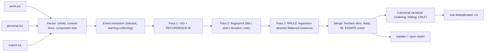

# calknit

[English](README.md) | [中文](README.zh.md) | [日本語](README.ja.md)

[](LICENSE)   [](CONTRIBUTING.md)

**calknit 把多个 .ics 日历源合并成一份去重后的规范日历文件——跨源事件身份匹配、感知重复规则的去重、完全离线、零运行时依赖。**


```bash
# not yet on npm — install from a checkout of this repository
npm install && npm run build && npm pack
npm install -g ./calknit-0.1.0.tgz
```

## 为什么选 calknit？

日历蔓延让事件无休止地重复：服务商的订阅源、邮件客户端的邀请、应用的导出文件都装着同一个会议——UID 有三个、时区写法有两种、标题还多了个 "Invitation:" 前缀。直接拼接 .ics 文件（多数合并脚本和托管合并服务的做法）会保留每一份副本；单文件 lint 工具能整理一个源，却完全看不到源与源之间的关系。calknit 按证据强度分三轮在源*之间*解析身份：先是精确的 `UID`+`RECURRENCE-ID`，再是保守的指纹（归一化标题 + 同一时钟上的相同开始时间 + 精确时长，并做 Windows→IANA 的 TZID 归一化，让 Outlook 副本匹配上它的 Google 双胞胎），最后是重复规则吸收——真正的 RRULE 引擎会展开每个幸存的系列，吞掉扁平化导出器为每次发生生成的独立副本。最新的副本获胜，落选者补上缺失字段，`EXDATE` 取并集，每个决定都能用 `calknit explain` 查看。输出是一份规范、确定、可 diff 的 .ics。

|  | calknit | MergeCal（托管） | ics-merger（npm） | vdirsyncer |
|---|---|---|---|---|
| 跨源身份匹配（超越 UID） | 有——标题+开始+时长指纹 | 无——只做拼接 | 无——只做拼接 | 无——是同步不是合并 |
| 感知重复规则的去重（扁平化实例） | 有，按 RRULE 计算 | 无 | 无 | 无 |
| 离线处理本地文件 | 是 | 否（SaaS，服务端抓取订阅源） | 是 | 是 |
| 确定性、可 diff 的输出 | 是，字节级稳定 + 幂等 | 不适用 | 否 | 不适用 |
| 解释每个合并决定 | 是（`explain`、`--json`） | 否 | 否 | 否 |
| 运行时依赖 | 0（仅需 Node.js） | 托管服务 | npm 包 | Python + 库 |

<sub>各项能力声明已对照各项目公开文档核对，2026-07。</sub>

## 功能

- **跨源身份识别，而非拼接**——不同 UID 下的同一事件由保守指纹找出：归一化标题、同一时钟上的相同开始时间、精确时长。三者必须全部一致；calknit 绝不只凭标题合并。
- **感知重复规则的去重**——内置 RRULE 引擎（DAILY/WEEKLY/MONTHLY/YEARLY、BYDAY 序数、BYMONTHDAY、BYSETPOS、WKST、EXDATE/RDATE）展开幸存系列，吸收其他工具永远重复保留的按次扁平化副本。
- **不怕时区写法差异**——`TZID=W. Europe Standard Time` 和 `TZID=Europe/Berlin` 通过 Windows→IANA 别名表得到相同指纹；全局唯一 ID 前缀和引号也被归一化，全程不做偏移计算、不带 tz 数据库。
- **最新副本获胜，信息零丢失**——优先级依次为 `SEQUENCE`、`LAST-MODIFIED`、`DTSTAMP`、命令行源顺序；落选者补上缺失的 `LOCATION`/`DESCRIPTION`/`URL`/...，`EXDATE` 跨副本取并集，字段分歧记录为冲突（`--strict` 下退出码 1）。
- **确定性的规范输出**——固定属性顺序、事件排序、75 字节且 UTF-8 安全的折行、CRLF、只保留被引用的 VTIMEZONE：同样的源进，同样的字节出，再次合并已合并文件不产生任何变化。
- **把过程摆在明面上**——`calknit explain` 打印每个保留/丢弃/补全/吸收决定及其出处；`--json` 以机器契约形式给出同样内容。
- **零运行时依赖，完全离线**——只需要 Node.js；工具从不打开套接字，`typescript` 是唯一的 devDependency。

## 快速上手

安装（见上），然后编织自带的三个示例源：

```bash
calknit merge examples/feeds/work.ics examples/feeds/personal.ics examples/feeds/team-export.ics -o all.ics
```

输出（真实运行记录——日历写入 `all.ics`，报告走 stderr）：

```text
calknit 0.1.0 — knitted 3 feeds
  input:  15 events (work.ics 5, personal.ics 5, team-export.ics 5)
  identity: 1 uid duplicate, 3 fingerprint duplicates, 3 flattened instances absorbed
  filled: DESCRIPTION<personal.ics, LOCATION<work.ics
  conflicts: 2 (freshest copy kept; see `calknit explain`)
  output: 8 events, 2 timezones
```

追问任何一次合并的理由（真实运行摘录）：

```text
= merged (fingerprint): "Quarterly planning" 2026-07-15 14:00 @Europe/Berlin
    kept    work.ics  uid qplan-q3@example.test seq 2
    dropped personal.ics  uid 040000008200E00074C5B7101A82E00800000000A1D52E@example.test
    filled  DESCRIPTION<personal.ics
    conflict SUMMARY: kept "Quarterly planning", dropped "Invitation: Quarterly planning" (personal.ics)

= absorbed by series team-sync-2026@example.test: "Team sync" 2026-07-20 09:30 @Europe/Berlin from team-export.ics (occurrence local:20260720T093000@europe/berlin)
```

让日历应用订阅 `all.ics`，或把合并放进 cron 定时跑——输出字节级稳定，下游同步只在真有变化时才触发。

## 命令与退出码

| 命令 | 作用 | 退出码 |
|---|---|---|
| `calknit merge <feeds...>` | 把多个源编织成一份日历（stdout 或 `-o FILE`） | 0 / 1（`--strict`）/ 2 |
| `calknit explain <feeds...>` | 打印每个身份决定；不写任何文件 | 0 / 1（`--strict`）/ 2 |
| `calknit inspect <feeds...>` | 逐源统计（事件、系列、时区、时间范围） | 0 / 1（`--strict`）/ 2 |

退出码 2 覆盖用法、解析和 IO 错误；可恢复的小毛病（坏的 `DTSTART`、未知的 RRULE 部件）降级为警告而非失败。

## 选项

| 键 | 默认值 | 效果 |
|---|---|---|
| `--match <level>` | `full` | `uid` = 仅 RFC 身份；`fingerprint` = 加标题/开始/时长；`full` = 再加重复规则吸收 |
| `--horizon <days>` | `1096` | 吸收时从每个系列起点向后展开发生次数的距离 |
| `-o, --output <file>` | stdout | 合并后日历的写入位置 |
| `--calname <name>` | 无 | 在输出上设置 `X-WR-CALNAME` |
| `--json` | 关 | 机器可读报告（merge 的报告走 stderr） |
| `--quiet` | 关 | merge：抑制 stderr 报告 |
| `--strict` | 关 | 输入警告或字段冲突时退出码 1 |

完整的身份规则手册在 [docs/matching.md](docs/matching.md)；输出保证在 [docs/canonical-format.md](docs/canonical-format.md)。`SOURCE_DATE_EPOCH` 可为可复现流水线固定合成的 `DTSTAMP`。

## 架构



## 路线图

- [x] 三轮身份引擎（UID、指纹、重复规则吸收）、支持 BYDAY/BYMONTHDAY/BYSETPOS/WKST 的 RRULE 展开、Windows→IANA TZID 归一化、最新者获胜的合并含字段补全 + EXDATE 并集、规范确定性输出、`explain`/`inspect`/`--json`——89 个测试 + `scripts/smoke.sh`（v0.1.0）
- [ ] 感知取消的合并：把 `STATUS:CANCELLED` 副本转成幸存系列上的 `EXDATE`
- [ ] `calknit watch`：任一输入文件变化时自动重新合并
- [ ] 逐源规则：匹配前的 include/exclude 过滤与标题改写
- [ ] 可选的疑似重复报告（同标题、开始时间相差 N 分钟内）供人工复核

完整列表见 [open issues](https://github.com/JaydenCJ/calknit/issues)。

## 贡献

欢迎贡献。先 `npm install && npm run build` 构建，然后运行 `npm test`（89 个测试）和 `bash scripts/smoke.sh`（必须打印 `SMOKE OK`）——本仓库不带 CI，以上每条声明都由本地运行验证。参阅 [CONTRIBUTING.md](CONTRIBUTING.md)，认领一个 [good first issue](https://github.com/JaydenCJ/calknit/issues?q=is%3Aissue+is%3Aopen+label%3A%22good+first+issue%22)，或发起 [discussion](https://github.com/JaydenCJ/calknit/discussions)。

## 许可证

[MIT](LICENSE)
